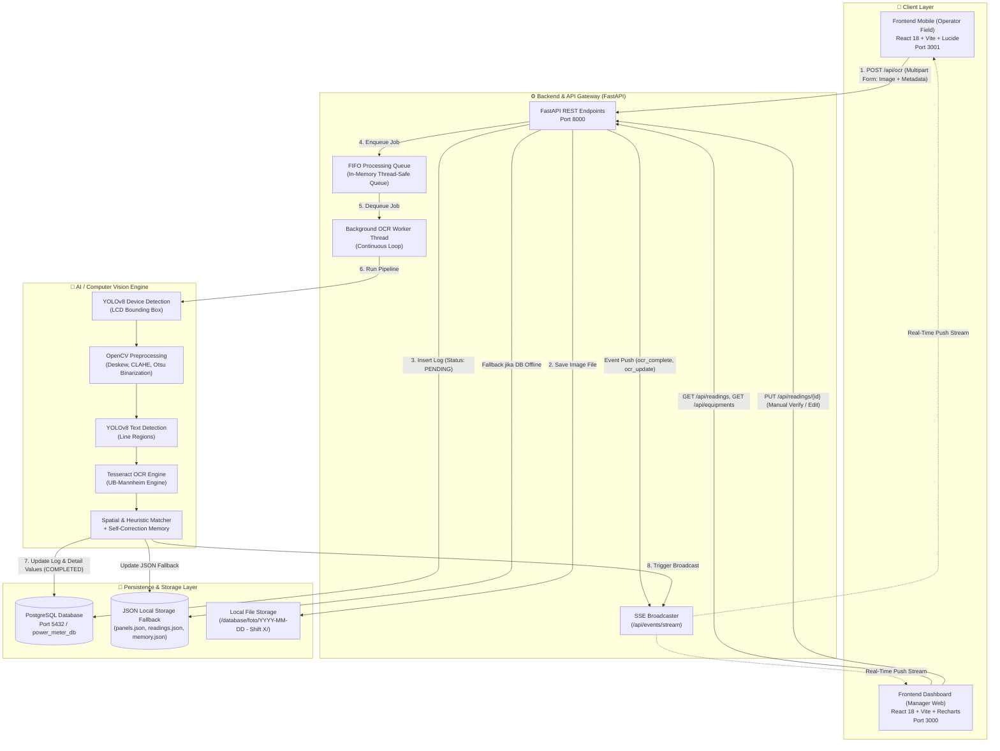
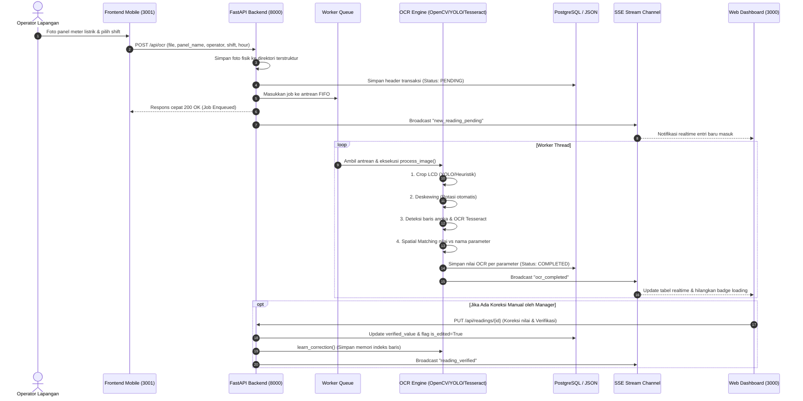

# 🏛️ Arsitektur Sistem: DC-Ops Power Meter OCR System

Dokumen ini mendokumentasikan arsitektur teknis menyeluruh, topologi komponen, alur data, skema basis data relasional, dan *pipeline* kecerdasan buatan (*Computer Vision & OCR*) pada sistem **Power Meter Reading (DC-Ops OCR)**.

---

## 📌 1. Gambaran Umum & Topologi Sistem (High-Level Architecture)

Sistem ini dirancang menggunakan arsitektur **Decoupled Modular Client-Server** dengan pemrosesan beban berat (*heavy computation*) secara asinkron (*asynchronous worker thread*) dan sinkronisasi status secara *real-time* via **Server-Sent Events (SSE)**.

---

## 🔄 2. Siklus Hidup & Alur Data (End-to-End Data Flow)

Siklus hidup pemrosesan data terdiri dari 5 tahapan terpadu:

---

## 🗄️ 3. Skema Basis Data Relasional (Database Architecture)

Sistem menggunakan **PostgreSQL 16** (dikelola via SQLAlchemy ORM) dengan model ternormalisasi pihak ketiga (*3rd Normal Form*), dilengkapi mekanisme *fallback* ke berkas JSON lokal jika koneksi database sedang tidak aktif.

### 3.1 Entity Relationship Diagram (ERD)

### 3.2 Dual-Persistence Mode (Resilience Architecture)
* **Primary Store:** PostgreSQL (`master_equipments`, `log_headers`, `log_details`, dsb). Digunakan untuk analitik historis, aggregasi laporan, kueri cepat dengan indeks b-tree, dan integrasi antar sistem.
* **Secondary / Fallback Store:** Berkas JSON lokal (`database/panels.json`, `database/readings.json`, `database/memory.json`). Jika PostgreSQL tidak dapat diakses saat *development* mandiri di laptop teknisi, backend secara otomatis beralih (*graceful fallback*) ke berkas JSON sehingga operasional lapangan tidak pernah terhenti.

---

## 🧠 4. Pipeline Computer Vision & AI OCR

Pipeline pengenalan optik dirancang khusus untuk menangani tantangan display digital data center (layar LCD 7-segment / dot matrix dengan pantulan cahaya, sudut miring, dan pencahayaan minim).

```mermaid
flowchart LR
    subgraph S1 ["1. Device Detection"]
        Raw["Foto Mentah"] --> YoloCrop{"Model YOLO<br/>Tersedia?"}
        YoloCrop -->|Ya| YoloBox["Deteksi Box Layar LCD<br/>+ 10% Margin"]
        YoloCrop -->|Tidak| CVContour["Heuristik OpenCV:<br/>Kontur Terang Terbesar /<br/>Top 75% Crop"]
    end

    subgraph S2 ["2. Deskewing & Orientasi"]
        YoloBox --> Hough["Hough Line Transform"]
        CVContour --> Hough
        Hough --> Rotate["Koreksi Sudut Kemiringan<br/>(Rotasi Otomatis)"]
    end

    subgraph S3 ["3. Enhancement & Binarization"]
        Rotate --> Gray["Grayscale Conversion"]
        Gray --> CLAHE["Peningkatan Kontras Dinamis<br/>(CLAHE)"]
        CLAHE --> Scale["Super-scaling 2.0x"]
        Scale --> Otsu["Otsu Threshold Binarization<br/>+ Pixel Morphological Erosion"]
    end

    subgraph S4 ["4. Text Extraction & Matching"]
        Otsu --> Tess["Tesseract OCR Engine<br/>(--psm 6 / digit whitelist)"]
        Tess --> Matcher{"Spatial Matcher"}
        Matcher -->|Garis Sama / Kolom Kanan| Result["Assign Nilai ke Parameter"]
        Matcher -->|Gagal Spasial| Mem["Self-Correction Memory<br/>(Fallback Indeks Baris)"]
        Mem --> Result
    end
```

### Karakteristik Unggulan Pipeline:
1. **Adaptive Self-Correction Memory:**
   * Saat operator atau manajer mengedit nilai OCR yang keliru melalui Dashboard Web, sistem memanggil fungsi `learn_correction()`.
   * Sistem mencatat indeks posisi baris teks tempat nilai yang benar berada, sehingga pada pembacaan berikutnya untuk tipe panel yang sama, AI langsung memprioritaskan baris tersebut.
2. **Character Error Rate (CER) Metric:**
   * Setiap kali verifikasi manual dilakukan, sistem menghitung metrik jarak Levenshtein antara `raw_ocr_value` dan `verified_value` untuk mengukur akurasi model AI secara kuantitatif.

---

## ⚡ 5. Arsitektur Komunikasi Real-Time (Server-Sent Events)

Alih-alih membuat antarmuka frontend melakukan *polling* terus-menerus (yang membebani CPU dan bandwidth), backend mengimplementasikan **Server-Sent Events (SSE)** melalui endpoint `/api/events/stream`.

* **Koneksi:** Frontend membuka 1 koneksi HTTP persistent menggunakan browser `EventSource`.
* **Kanal Siaran (*Broadcast Queue*):** Backend menggunakan `asyncio.Queue` per klien aktif yang dikelola oleh `MAIN_LOOP`.
* **Jenis Event yang Dikirimkan:**
  * `NEW_READING`: Ketika operator mengunggah foto baru.
  * `READING_UPDATED`: Ketika pemrosesan OCR selesai di latar belakang.
  * `READING_DELETED`: Ketika manajer menghapus rekaman pembacaan.
  * `PANEL_UPDATED`: Ketika konfigurasi panel atau parameter diubah.
* **Mekanisme Failover:** Jika koneksi SSE terputus, frontend secara otomatis beralih ke interval *silent polling* setiap 15 detik sampai koneksi SSE tersambung kembali.

---

## 🚢 6. Topologi Deployment & Kontainerisasi

Aplikasi dapat dijalankan dalam 2 mode:

### 1. Mode Kontainerisasi Docker (Rekomendasi Produksi)
Menggunakan `docker-compose.yml` yang mengorkestrasi 4 kontainer terisolasi:
* `dc_ops_postgres` (Port `5432`): Database PostgreSQL 16 Alpine dengan volume persisten `postgres_data`.
* `backend` (Port `8000`): Python 3.10 + OpenCV + Tesseract OCR + FastAPI.
* `frontend-dashboard` (Port `3000`): React Vite Web Server untuk workstation manajer.
* `frontend-mobile` (Port `3001`): React Vite Web Server untuk perangkat genggam operator lapangan.

### 2. Mode Native Windows (Rekomendasi Pengujian Lokal)
* Backend dijalankan langsung menggunakan skrip otomatis [`start_backend.bat`](file:///d:/Program/Power_meter_reading_Bion/start_backend.bat) yang mengisolasi lingkungan via virtual environment Python (`.venv`).
* Frontend dijalankan via `npm run dev` pada Node.js LTS.

---

## 🔒 7. Standar Keamanan & Keandalan Data (Reliability)

1. **Integritas Transaksi:** Penghapusan master equipment menerapkan `ON DELETE CASCADE` untuk parameter dan `ON DELETE SET NULL` untuk histori log agar riwayat audit data operasional masa lalu tidak hilang.
2. **Thread Safety:** Antrean OCR menggunakan modul `queue.Queue` standar Python yang aman terhadap persaingan thread (*thread-safe*), mencegah tabrakan proses saat puluhan operator mengunggah foto bersamaan di pergantian shift.
3. **Penyimpanan Gambar Idempoten:** Foto disimpan dengan penamaan berbasis *timestamp* unik dan folder berjenjang tanggal/shift untuk mencegah penimpaan berkas (*file overwrites*).
