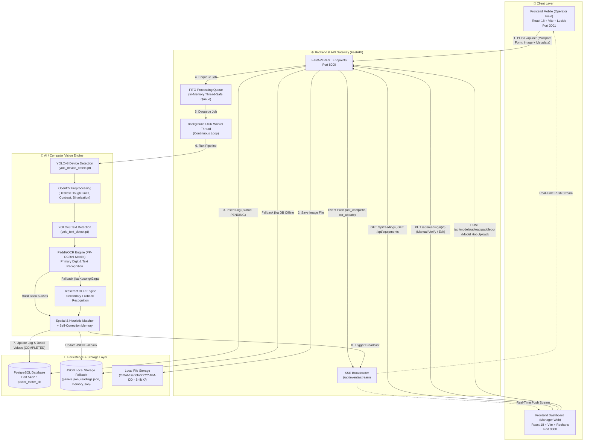
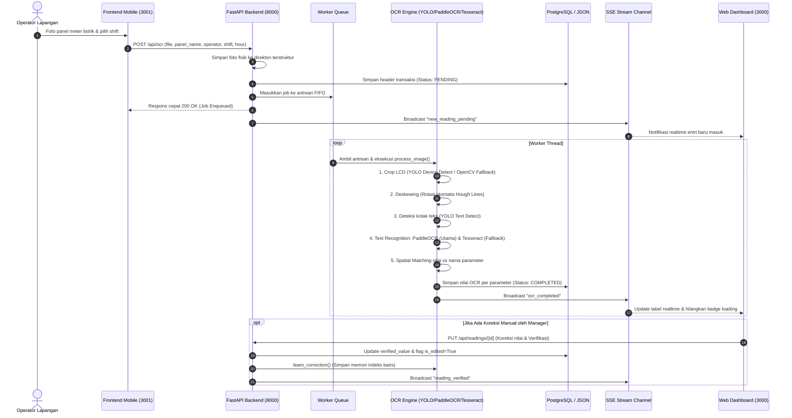
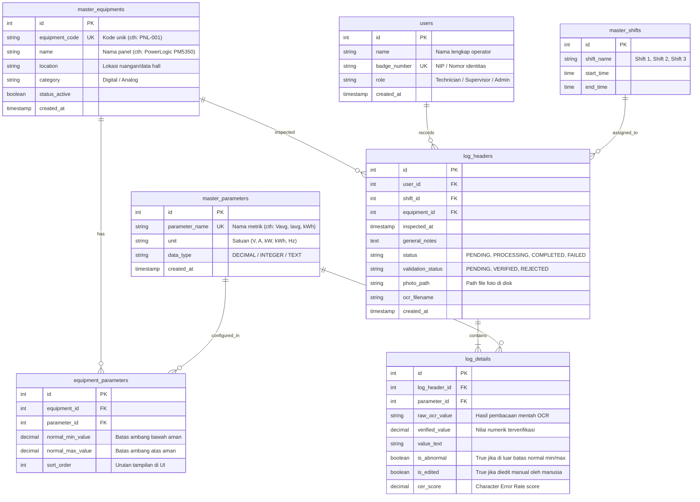

# 🏛️ Arsitektur Sistem: DC-Ops Power Meter OCR System

Dokumen ini mendokumentasikan arsitektur teknis menyeluruh, topologi komponen, alur data, skema basis data relasional, dan *pipeline* kecerdasan buatan (*Computer Vision & OCR*) pada sistem **Power Meter Reading (DC-Ops OCR)**.

---

## 📌 1. Gambaran Umum & Topologi Sistem (High-Level Architecture)

Sistem ini dirancang menggunakan arsitektur **Decoupled Modular Client-Server** dengan pemrosesan beban berat (*heavy computation*) secara asinkron (*asynchronous worker thread*) dan sinkronisasi status secara *real-time* via **Server-Sent Events (SSE)**.



---

## 🔄 2. Siklus Hidup & Alur Data (End-to-End Data Flow)

Siklus hidup pemrosesan data terdiri dari 5 tahapan terpadu:



---

## 🗄️ 3. Skema Basis Data Relasional (Database Architecture)

Sistem menggunakan **PostgreSQL 16** (dikelola via SQLAlchemy ORM) dengan model ternormalisasi pihak ketiga (*3rd Normal Form*), dilengkapi mekanisme *fallback* ke berkas JSON lokal jika koneksi database sedang tidak aktif.

### 3.1 Entity Relationship Diagram (ERD)



### 3.2 Dual-Persistence Mode (Resilience Architecture)
* **Primary Store:** PostgreSQL (`master_equipments`, `log_headers`, `log_details`, dsb). Digunakan untuk analitik historis, aggregasi laporan, kueri cepat dengan indeks b-tree, dan integrasi antar sistem.
* **Secondary / Fallback Store:** Berkas JSON lokal (`database/panels.json`, `database/readings.json`, `database/memory.json`). Jika PostgreSQL tidak dapat diakses saat *development* mandiri di laptop teknisi, backend secara otomatis beralih (*graceful fallback*) ke berkas JSON sehingga operasional lapangan tidak pernah terhenti.

---

## 🧠 4. Pipeline Computer Vision & AI OCR

Pipeline pengenalan optik dirancang khusus untuk menangani tantangan display digital data center (layar LCD 7-segment / dot matrix dengan pantulan backlight, sudut kemiringan miring, pencahayaan minim, dan format metrik multi-baris seperti Schneider PowerLogic).

Sistem menerapkan pendekatan **Hybrid Multi-Stage Pipeline** yang memadukan keunggulan **YOLOv8** untuk lokalisasi objek/teks, **PaddleOCR (PP-OCRv4 Mobile)** untuk pembacaan karakter berakurasi tinggi, dan **Tesseract OCR** sebagai mekanisme *fail-safe fallback*.

```mermaid
flowchart TD
    subgraph S1 ["1. Device & LCD Detection"]
        Raw["Foto Mentah Lapangan"] --> YoloDevCheck{"Model YOLO Device<br/>Tersedia?"}
        YoloDevCheck -->|Ya| YoloDev["YOLOv8 Device Detection<br/>(yolo_device_detect.pt, conf=0.01)<br/>+ 5% Padding"]
        YoloDevCheck -->|Tidak / Gagal| CVContour["Heuristik OpenCV LCD Fallback:<br/>Gaussian Blur + Otsu/High Thresh<br/>+ Deteksi Kontur Segiempat"]
        CVContour -->|Jika Masih Gagal| FallbackCrop["Potong 25% Area Atas<br/>(Abaikan label panel)"]
    end

    subgraph S2 ["2. Deskewing & Orientasi"]
        YoloDev --> Deskew["Canny Edge + HoughLinesP<br/>Hitung Median Sudut Kemiringan"]
        CVContour --> Deskew
        FallbackCrop --> Deskew
        Deskew --> Warp["Warp Affine Rotation<br/>(Koreksi Kemiringan -30° s/d +30°)"]
    end

    subgraph S3 ["3. Text Region Detection & NMS"]
        Warp --> YoloText["YOLOv8 Text Detection<br/>(yolo_text_detect.pt, conf > 0.5)"]
        YoloText --> NMS["Manual NMS Deduplication<br/>(Filter IoU > 0.4 & Sort Top-to-Bottom)"]
    end

    subgraph S4 ["4. Dual Recognition Engine (OCR)"]
        NMS --> CropEach["Potong Setiap Box Karakter"]
        CropEach --> PaddleCheck{"PaddleOCR Engine<br/>Tersedia & Siap?"}
        PaddleCheck -->|Ya (Prioritas 1)| Paddle["PaddleOCR (PaddleX en_PP-OCRv4_mobile_rec)<br/>Inference langsung pada Crop Asli"]
        PaddleCheck -->|Tidak / Gagal / Output Kosong| PreTess["6-Step OpenCV Preprocessing:<br/>Resize Lanczos (H=70) + Otsu Binarization<br/>+ Inversion + Morphological Erode + Padding"]
        Paddle -->|Hasil Teks Kosong| PreTess
        PreTess --> TessBox["Tesseract OCR Engine<br/>(--psm 7 Single Line)"]
    end

    subgraph S5 ["5. Post-Processing & Spatial Matching"]
        Paddle -->|Teks & Skor Valid| RowCluster["Row Clustering Spasial<br/>(Toleransi vertikal 50% box height)"]
        TessBox -->|Teks Valid| RowCluster
        Warp -.->|Cadangan Terakhir| FullTess["Full-Display Fallback OCR<br/>(Tesseract --psm 6)"]
        FullTess -.-> StratC
        
        RowCluster --> StratA["Strategi A: Spatial Row Anchor<br/>(Pencocokan Label Kiri ➔ Angka Kanan)"]
        StratA --> StratB["Strategi B: Adaptive Self-Correction Memory<br/>(Fallback Indeks Baris dari memory.json)"]
        StratB --> StratC["Strategi C: Labeled Pairs Regex Parser<br/>(Vavg, Iavg, Ptot, E Del + Unit)"]
        StratC --> Final["Nilai Parameter Terbaca<br/>(Vavg, Iavg, Ptot, E Del, dll)"]
    end
```

### 4.1 Rincian Tahapan Pipeline

1. **Step 1: Device Detection (LCD Cropping)**
   - Menggunakan model `yolo_device_detect.pt` dengan ambang batas *confidence* 0.01 dan ekspansi margin 5% agar area angka dan satuan tidak terpotong.
   - Jika YOLO tidak mendeteksi display atau model belum diunduh, sistem menjalankan *OpenCV LCD detection fallback* yang mencari kontur persegi panjang berlatar terang pada kuadran tengah-bawah gambar.
2. **Step 2: Deskewing Otomatis**
   - Mendeteksi garis tepi melalui `cv2.Canny` dan `cv2.HoughLinesP`.
   - Mengambil median kemiringan sudut (rentang valid: $0.5^\circ < |\theta| < 30^\circ$) dan merotasi citra display secara presisi menggunakan `cv2.warpAffine` dengan interpolasi bicubic.
3. **Step 3: Text Detection & Deduplikasi Spasial (NMS)**
   - Menggunakan model `yolo_text_detect.pt` pada display yang telah lurus untuk melokalisasi baris angka dan label (ambang batas `conf > 0.5`).
   - Menerapkan algoritma *Non-Maximum Suppression* (NMS) manual untuk membuang kotak deteksi ganda dengan *Intersection-over-Union* (IoU) $> 0.4$, lalu mengurutkan kotak dari atas ke bawah.
4. **Step 4: Dual Recognition Engine (PaddleOCR + Tesseract Fallback)**
   - **Prioritas 1 (PaddleOCR PP-OCRv4 Mobile)**:
     - Dikelola melalui modul `paddlex` (`import paddlex as px`).
     - Memuat arsitektur `en_PP-OCRv4_mobile_rec` dari direktori `backend/models/power_meter_rec_inference/PaddleOCR/inference/power_meter_rec`.
     - Dijalankan langsung pada citra crop berwarna asli. Model ini dirancang khusus untuk mengenali karakter teks dan digit dengan latensi inferensi ultra-cepat (< 30 ms per crop) dan ketahanan sangat tinggi terhadap distorsi font LCD dot-matrix dan 7-segment.
   - **Prioritas 2 (Fallback Tesseract OCR)**:
     - Jika PaddleOCR tidak terinstal, bobot model belum dimuat, atau menghasilkan pembacaan kosong, sistem mengalihkan crop ke Tesseract OCR (`--psm 7`).
     - Citra crop diproses terlebih dahulu melalui 6 tahap: konversi grayscale, penskalaan tinggi menjadi 70 px dengan interpolasi Lanczos-4, binarisasi Otsu, inversi kontras (memastikan digit berwarna hitam dengan latar putih), erosi morfologi untuk memperjelas sambungan segmen angka, serta penambahan *border padding* putih 20-50 px.
   - **Prioritas 3 (Full-Display Fallback)**:
     - Jika kotak deteksi YOLO sangat sedikit, sistem menjalankan Tesseract pada seluruh area display LCD (`--psm 6`) sebagai jaring pengaman terakhir.
5. **Step 5: Multi-Strategy Spatial & Memory Matching**
   - **Strategi A (Spatial Row-Based Anchor)**: Mengelompokkan item yang memiliki koordinat Y berdekatan (toleransi $50\%$ tinggi kotak). Pasangan label di sisi kiri (seperti `Vavg`, `Iavg`, `Ptot`, `E Del`) secara otomatis dipasangkan dengan nilai numerik terdekat di sisi kanan pada baris yang sama.
   - **Strategi B (Adaptive Self-Correction Memory)**: Jika pencocokan spasial tidak menemukan pasangan, sistem membuka berkas `database/memory.json` untuk memetakan indeks baris rekaman historis yang pernah diverifikasi oleh manajer.
   - **Strategi C (Regex Labeled Pairs Parser)**: Mengekstrak pola `[Label] [Angka] [Satuan]` dari teks mentah untuk mengidentifikasi metrik standar (*synonym mapping* mencakup variasi OCR seperti `v ave`, `1.avg`, `iawg`, `pwr`, dsb).

### 4.2 Manajemen & Hot-Upload Model AI

Sistem menyediakan integrasi penuh antara antarmuka Web Dashboard dan backend untuk memperbarui bobot model AI tanpa perlu menghentikan (*downtime*) server:
* `POST /api/models/upload/paddleocr`: Menerima arsip `.zip` model inferensi PaddleOCR, mengekstrak secara otomatis ke `backend/models/power_meter_rec_inference`, dan siap dimuat ulang.
* `POST /api/models/upload/yolo-device`: Mengunggah bobot deteksi panel/display (`.pt`).
* `POST /api/models/upload/yolo-text`: Mengunggah bobot deteksi teks/digit (`.pt`).
* `POST /api/models/upload/tesseract`: Mengunggah model bahasa kustom Tesseract (`.traineddata`).

### 4.3 Karakteristik Unggulan Pipeline:
1. **Adaptive Self-Correction Memory:**
   * Saat operator atau manajer mengedit nilai OCR yang keliru melalui Dashboard Web, sistem memanggil fungsi `learn_correction()`.
   * Sistem mencatat indeks posisi baris teks tempat nilai yang benar berada, sehingga pada pembacaan berikutnya untuk tipe panel yang sama, AI langsung memprioritaskan baris tersebut.
2. **Character Error Rate (CER) Metric:**
   * Setiap kali verifikasi manual dilakukan, sistem menghitung metrik jarak Levenshtein antara `raw_ocr_value` dan `verified_value` untuk mengukur akurasi model AI secara kuantitatif.

---

## ⚡ 5. Arsitektur Komunikasi Real-Time (Server-Sent Events)

Alih-alih membuat antarmuka frontend melakukan *polling* terus-menerus (yang membebani CPU dan bandwidth), backend mengimplementasikan **Server-Sent Events (SSE)** melalui endpoint `/api/events/stream`.

* **Koneksi:** Frontend membuka 1 koneksi HTTP persistent menggunakan browser `EventSource`.
* **Kanal Siaran (*Broadcast Queue*):** Backend menggunakan `asyncio.Queue` per klien aktif yang dikelola oleh `MAIN_LOOP`.
* **Jenis Event yang Dikirimkan:**
  * `NEW_READING`: Ketika operator mengunggah foto baru.
  * `READING_UPDATED`: Ketika pemrosesan OCR selesai di latar belakang.
  * `READING_DELETED`: Ketika manajer menghapus rekaman pembacaan.
  * `PANEL_UPDATED`: Ketika konfigurasi panel atau parameter diubah.
* **Mekanisme Failover:** Jika koneksi SSE terputus, frontend secara otomatis beralih ke interval *silent polling* setiap 15 detik sampai koneksi SSE tersambung kembali.

---

## 🚢 6. Topologi Deployment & Kontainerisasi

Aplikasi dapat dijalankan dalam 2 mode:

### 1. Mode Kontainerisasi Docker (Rekomendasi Produksi)
Menggunakan `docker-compose.yml` yang mengorkestrasi 4 kontainer terisolasi:
* `dc_ops_postgres` (Port `5432`): Database PostgreSQL 16 Alpine dengan volume persisten `postgres_data`.
* `backend` (Port `8000`): Python 3.10 + OpenCV + Tesseract OCR + FastAPI.
* `frontend-dashboard` (Port `3000`): React Vite Web Server untuk workstation manajer.
* `frontend-mobile` (Port `3001`): React Vite Web Server untuk perangkat genggam operator lapangan.

### 2. Mode Native Windows (Rekomendasi Pengujian Lokal)
* Backend dijalankan langsung menggunakan skrip otomatis [`start_backend.bat`](file:///d:/Program/Power_meter_reading_Bion/start_backend.bat) yang mengisolasi lingkungan via virtual environment Python (`.venv`).
* Frontend dijalankan via `npm run dev` pada Node.js LTS.

---

## 🔒 7. Standar Keamanan & Keandalan Data (Reliability)

1. **Integritas Transaksi:** Penghapusan master equipment menerapkan `ON DELETE CASCADE` untuk parameter dan `ON DELETE SET NULL` untuk histori log agar riwayat audit data operasional masa lalu tidak hilang.
2. **Thread Safety:** Antrean OCR menggunakan modul `queue.Queue` standar Python yang aman terhadap persaingan thread (*thread-safe*), mencegah tabrakan proses saat puluhan operator mengunggah foto bersamaan di pergantian shift.
3. **Penyimpanan Gambar Idempoten:** Foto disimpan dengan penamaan berbasis *timestamp* unik dan folder berjenjang tanggal/shift untuk mencegah penimpaan berkas (*file overwrites*).
